# Adrienne Walsh

Adrienne Walsh is a site that showcases Adrienne's acting and costume design skills, experience, and achievements. It is a way to present her to potential casting directors, agents, and producers who might be interested in casting her as an actor in theatre, film or radio or hiring her as costume designer, assitant or maintanence for their projects.

## Features 

In this section, you should go over the different parts of your project, and describe each in a sentence or so. You will need to explain what value each of the features provides for the user, focusing on who this website is for, what it is that they want to achieve and how your project is the best way to help them achieve these things.

### Existing Features

- __Navigation Bar__

  - Featured on all three pages, the full responsive navigation bar includes links to the Logo, Home page, Gallery and Sign Up page and is identical in each page to allow for easy navigation.
  - This section will allow the user to easily navigate from page to page across all devices without having to revert back to the previous page via the ‘back’ button. 

- __The landing page image__

  - The landing includes a photograph with text overlay to allow the user to see exactly which location this site would be applicable to. 
  - This section introduces the user to Love Running with an eye catching animation to grab their attention

- __Club Ethos Section__

  - The club ethos section will allow the user to see the benefits of joining the Love Running meetups, as well as the benefits of running overall. 
  - This user will see the value of signing up for the Love Running meetups. This should encourage the user to consider running as their form of exercise. 

- __Meetup Times section__

  - This section will allow the user to see exactly when the meetups will happen, where they will be located and how long the run will be in kilometers. 
  - This section will be updated as these times change to keep the user up to date. 

- __The Footer__ 

  - The footer section includes links to the relevant social media sites for Love Running. The links will open to a new tab to allow easy navigation for the user. 
  - The footer is valuable to the user as it encourages them to keep connected via social media

- __Gallery__

  - The gallery will provide the user with supporting images to see what the meet ups look like. 
  - This section is valuable to the user as they will be able to easily identify the types of events the organisation puts together. 

- __The Sign Up Page__

  - This page will allow the user to get signed up to Love Running to start their running journey with the community. The user will be able specify if they would like to take part in road, trail or both types of running. The user will be asked to submit their full name and email address. 

For some/all of your features, you may choose to reference the specific project files that implement them.

In addition, you may also use this section to discuss plans for additional features to be implemented in the future:

### Features Left to Implement

- Another feature idea

## Testing 

In this section, you need to convince the assessor that you have conducted enough testing to legitimately believe that the site works well. Essentially, in this part you will want to go over all of your project’s features and ensure that they all work as intended, with the project providing an easy and straightforward way for the users to achieve their goals.

In addition, you should mention in this section how your project looks and works on different browsers and screen sizes.

You should also mention in this section any interesting bugs or problems you discovered during your testing, even if you haven't addressed them yet.

If this section grows too long, you may want to split it off into a separate file and link to it from here.

### Validator Testing 

- HTML
  - No errors were returned when passing through the official [W3C validator](https://validator.w3.org/nu/?doc=https%3A%2F%2Fcode-institute-org.github.io%2Flove-running-2.0%2Findex.html)
- CSS
  - No errors were found when passing through the official [(Jigsaw) validator](https://jigsaw.w3.org/css-validator/validator?uri=https%3A%2F%2Fvalidator.w3.org%2Fnu%2F%3Fdoc%3Dhttps%253A%252F%252Fcode-institute-org.github.io%252Flove-running-2.0%252Findex.html&profile=css3svg&usermedium=all&warning=1&vextwarning=&lang=en#css)

### Unfixed Bugs

You will need to mention unfixed bugs and why they were not fixed. This section should include shortcomings of the frameworks or technologies used. Although time can be a big variable to consider, paucity of time and difficulty understanding implementation is not a valid reason to leave bugs unfixed. 

## Deployment

This section should describe the process you went through to deploy the project to a hosting platform (e.g. GitHub) 

- The site was deployed to GitHub pages. The steps to deploy are as follows: 
  - In the GitHub repository, navigate to the Settings tab 
  - From the source section drop-down menu, select the Master Branch
  - Once the master branch has been selected, the page will be automatically refreshed with a detailed ribbon display to indicate the successful deployment. 

The live link can be found here - https://code-institute-org.github.io/love-running-2.0/index.html 

## Credits 

In this section you need to reference where you got your content, media and extra help from. It is common practice to use code from other repositories and tutorials, however, it is important to be very specific about these sources to avoid plagiarism. 

You can break the credits section up into Content and Media, depending on what you have included in your project. 

### Content 

- The text for the Home page was taken from Wikipedia Article A
- Instructions on how to implement form validation on the Sign Up page was taken from [Specific YouTube Tutorial](https://www.youtube.com/)
- The icons in the footer were taken from [Font Awesome](https://fontawesome.com/)

### Media

- The photos used on the home and sign up page are from This Open Source site
- The images used for the gallery page were taken from this other open source site

Congratulations on completing your Readme, you have made another big stride in the direction of being a developer! 

## Other General Project Advice

Below you will find a couple of extra tips that may be helpful when completing your project. Remember that each of these projects will become part of your final portfolio so it’s important to allow enough time to showcase your best work! 

- One of the most basic elements of keeping a healthy commit history is with the commit message. When getting started with your project, read through [this article](https://chris.beams.io/posts/git-commit/) by Chris Beams on How to Write  a Git Commit Message 
  - Make sure to keep the messages in the imperative mood 

- When naming the files in your project directory, make sure to consider meaningful naming of files, point to specific names and sections of content.
  - For example, instead of naming an image used ‘image1.png’ consider naming it ‘landing_page_img.png’. This will ensure that there are clear file paths kept. 

- Do some extra research on good and bad coding practices, there are a handful of useful articles to read, consider reviewing the following list when getting started:
  - [Writing Your Best Code](https://learn.shayhowe.com/html-css/writing-your-best-code/)
  - [HTML & CSS Coding Best Practices](https://medium.com/@inceptiondj.info/html-css-coding-best-practice-fadb9870a00f)
  - [Google HTML/CSS Style Guide](https://google.github.io/styleguide/htmlcssguide.html#General)

Getting started with your Portfolio Projects can be daunting, planning your project can make it a lot easier to tackle, take small steps to reach the final outcome and enjoy the process! 

<h1 align="center">Adrienne Walsh Website</h1>

[View the live project here](https://maryclaireteahan.github.io/adriennewalsh/)

Adrienne Walsh is a site that showcases Adrienne's acting and costume design skills, experience, and achievements. It is a way to present her to potential casting directors, agents, and producers who might be interested in casting her as an actor in theatre, film or radio or hiring her as costume designer, assistant or maintanence for their projects.

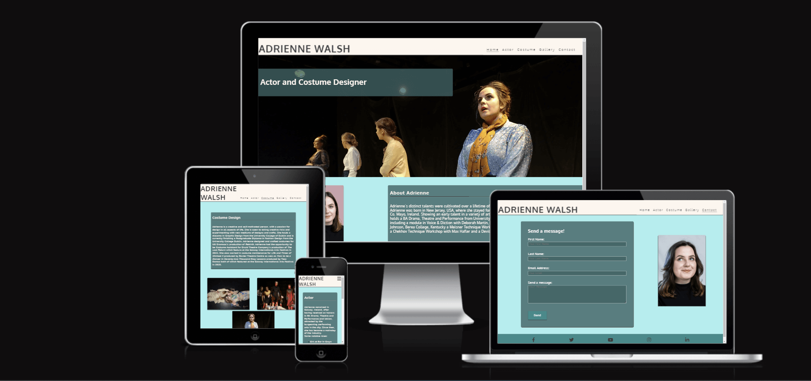

## Index – Table of Contents
* [User Experience (UX)](#user-experience-ux) 
* [Features](#features)
* [Design](#design)
* [Technologies Used](#technologies-used)
* [Testing](#testing)
* [Deployment](#deployment)
* [Credits](#credits)

## User Experience (UX)

-   ### User stories

    -   #### A. First Time Visitor Goals

        1. As a First Time Visitor, I want to easily understand the main purpose of the site and learn more about Adrienne as an actor and costume designer.
        2. As a First Time Visitor, I want to be able to easily navigate throughout the site to find content.
        3. As a First Time Visitor, I want to be able to easily navigate to and view Adrienne's past acting roles and experience with costume design.
        4. As a First Time Visitor, I want to be able to easily see what Adrienne looks like and pictures of past roles and costume designs.

    -   #### B. Returning Visitor Goals

        1. As a Returning Visitor, I want to be able to access and view the menu quickly and easily.
        2. As a Returning Visitor, I want to be able to contact Adrienne.

    -   #### C. Frequent User Goals
        1. As a Frequent User, I want to be able to access Adrienne's social media platforms.
     

## Features

### Existing Features

-   __F01 Navigation Bar__

    - The navigation bar has a consistent look and placement on all three pages of the website supporting easy navigation.  It includes a simple Logo, and the menu options: Home page, Actor page, Costume page, Gallery page and Contact page and is responsive on multiple screen sizes.  On small screens (e.g. mobile devices) the menu options are hidden until a burger icon is clicked which then brings up the menu options.

      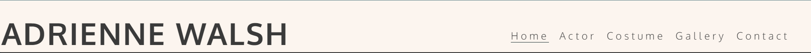
    

-   __F02 Landing Page image and call to action__

    - The landing area includes a background photograph and a text overlay that together clearly identify Adrienne, both what she looks like and her profession. 

      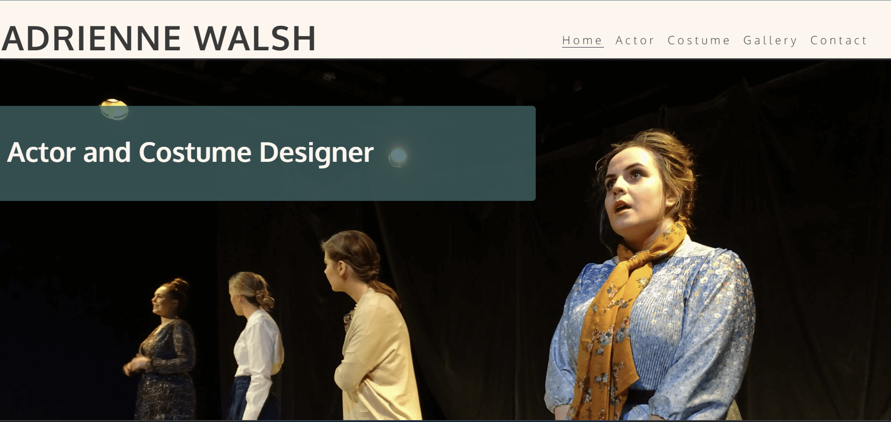

- __F03 About Adrienne__

    - This section of text introduces the user to Adrienne with background knowledge of Adrienne that is basic yet still relevant to her acting and costume design experience. 

      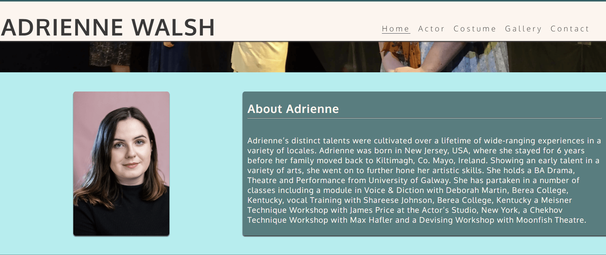

- __F04 Footer__

    - The footer is featured on all five pages and is identical on each page making it easy to use.  It contains links to Adrienne's social media accounts, facebook, twitter, youtube, instagram and linkedin. The links are represented by favicon images of those sites' own logos.
    
      

- __F05 Actor Page__

    - This section of text gives the user to deeper with background of Adrienne's experience in acting. It informs the user of Adrienne's qualifications in theatre. It also features a list of her most recent roles as well as an image of her on stage in a previous role she has played.

      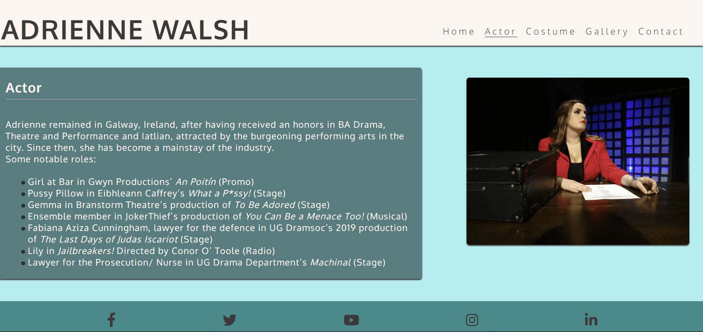

- __F06 Costume Page__

    - This page of text gives the user to deeper with background of Adrienne's experience in costume design. It informs the user of Adrienne's qualifications in fashion and graphic design as well as past projects in which she has been involved. There are three pictures including showcasing costumes designs with which she has been involved.

       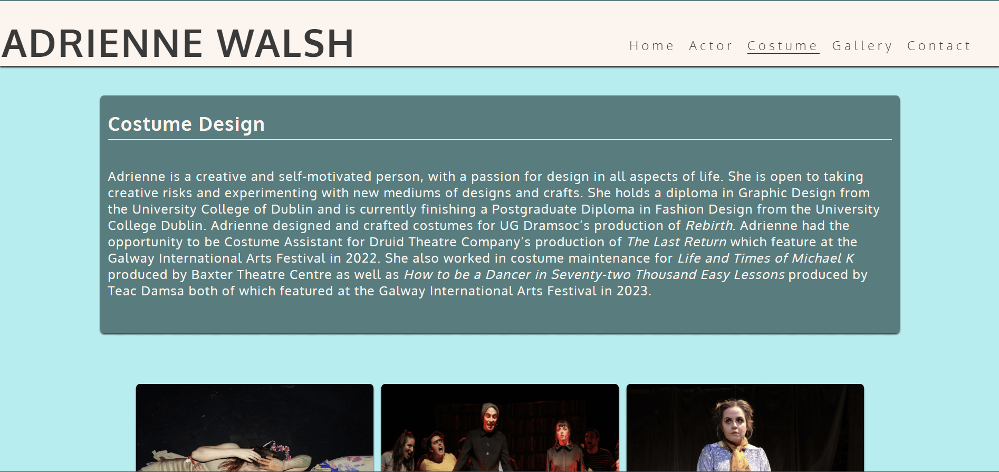
        
        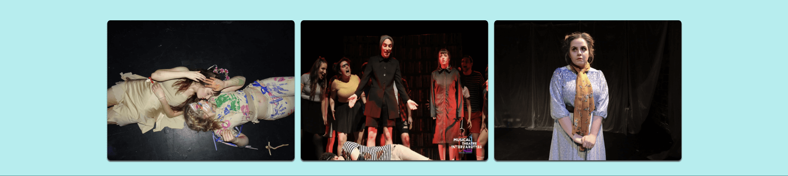

- __F07 Gallery Page__

    - The gallery feature six pictures. Each picture is of a show that Adrienne has either acted in or designed costumes for or both. The pictures from different angles give a good scope of her range of talent for prospective employers that may visit the site.

      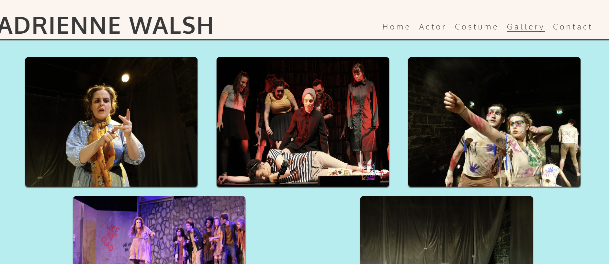

      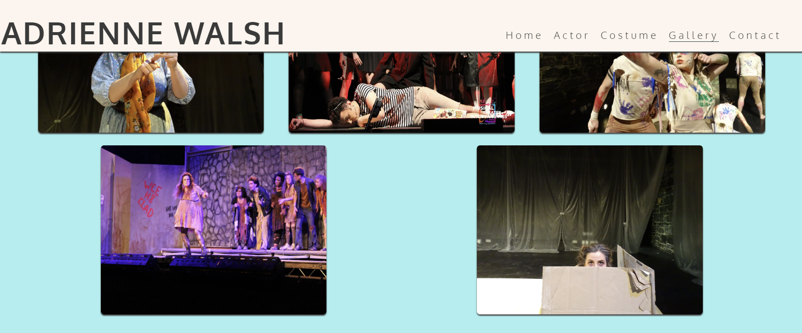

- __F08 Contact Page - 'Send a message!'__

    - The 'Send a message!' panel of the Contact page allows the user to send a message/give feedback to Adrienne and if they want. The user is asked to provide their first name, last name and email address when sending a message. Sending the message will result in a new tab showing the results (at the moment the user is simply shown the formdump.codeinstitute.net page with the data they submitted displayed)

    

- __How these features support the User Stories__

    - The User Stories in the [User Experience (UX)](#user-experience-ux) part of this document are numbered and categorised into groups A (first time visitor), B (returning visitor) and C (frequent visitor).  The existing features are listed above as F01 to F08.  Below is a traceability matrix cross-referencing the user stories with the features, illustrating which features support which stories :

    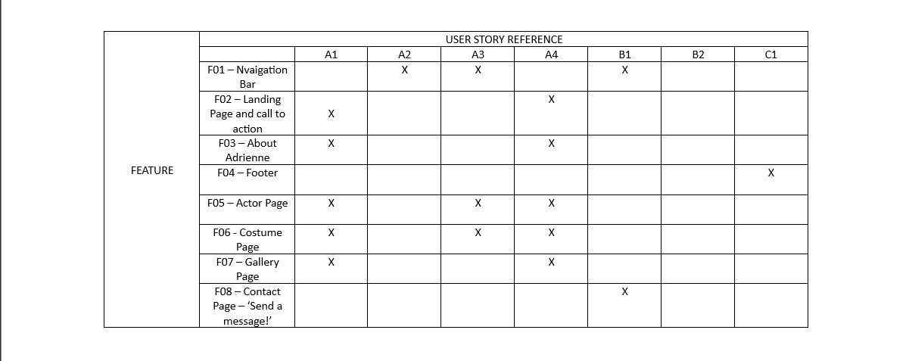

### Features which could be implemented in the future

- __Company Timeline__
    - A 'Company Timeline' page could be added to provide more information on the evolution of the business for users who would like to know more about the origins of the company, its ethos and its involvement with the community.

- __Navigation bar improvements__
    - The functionality of the navigation bar could be extended to make it "sticky" so that it would be available to the user without scrolling.
    - A hamburger menu could be implemented to save space on smaller screens.

## Design

-   ### Imagery
    -   The hero image was chosen because is is eye-catching, with an obvious main focus on Adrienne. The dark colours of the blackbox theatre contrasts nicely with the soft colour palette of the site. The rest of the images used throughout the site are from a range of different shows. While the consistency between the images may vary, they are successful at visually showcasing Adrienne's experiences in acting and costume design.

-   ### Colour Scheme
    -  The colour scheme was created by me based off of Adrienne's dress in the first image. It is subtle, but when viewed closely, there are green leaves on her dress which inspired the colours used throughout the site.

        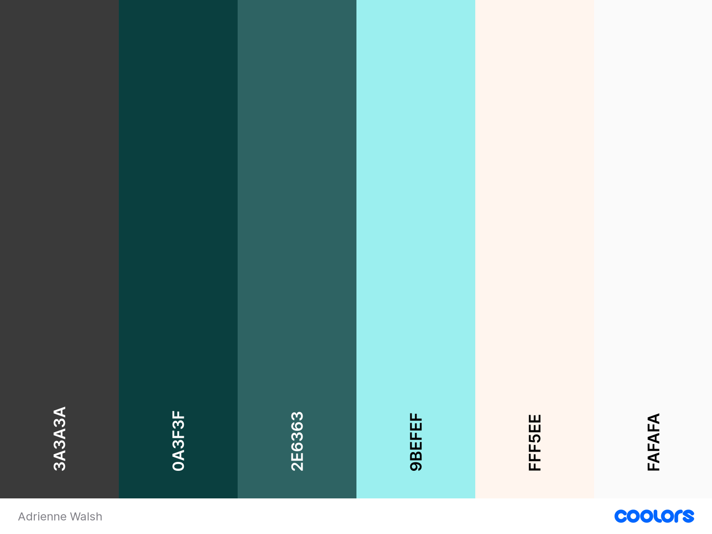

-   ### Typography
    -   Google Fonts were used to import Oxygen font into styles.css.  It was chosen as it is a simple, font with a strong clear feel that doesn't distract from the content.

-   ### Wireframes

    -   #### Home Page Wireframes

        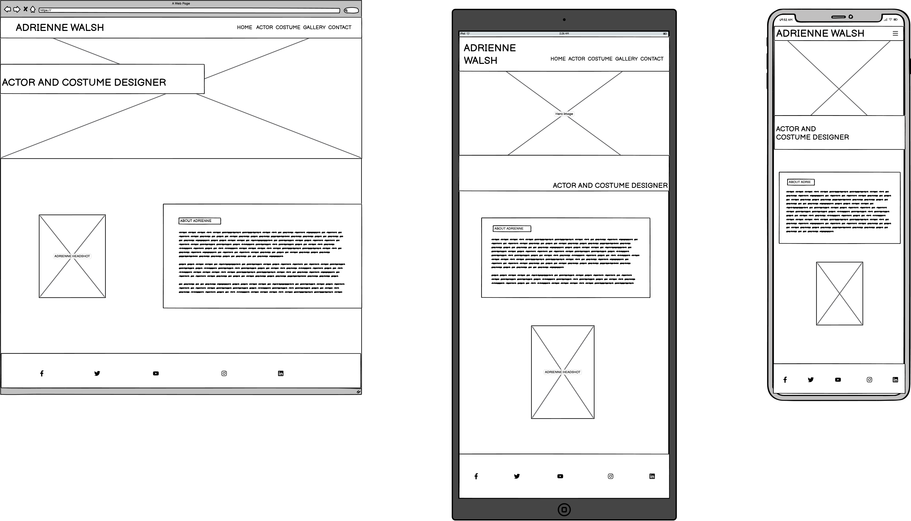

    -   #### Actor Page Wireframes

        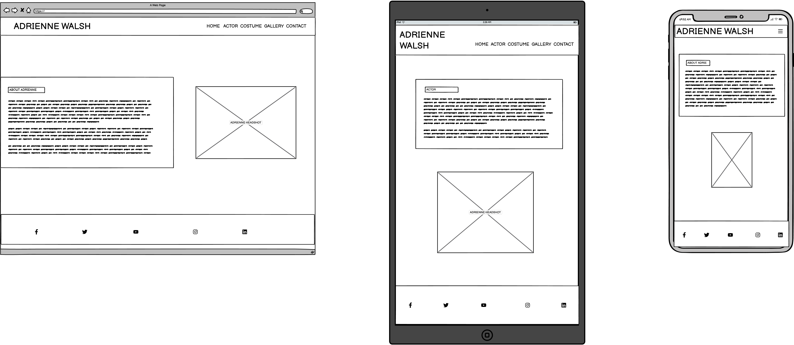)

    -   #### Costume Page Wireframes

        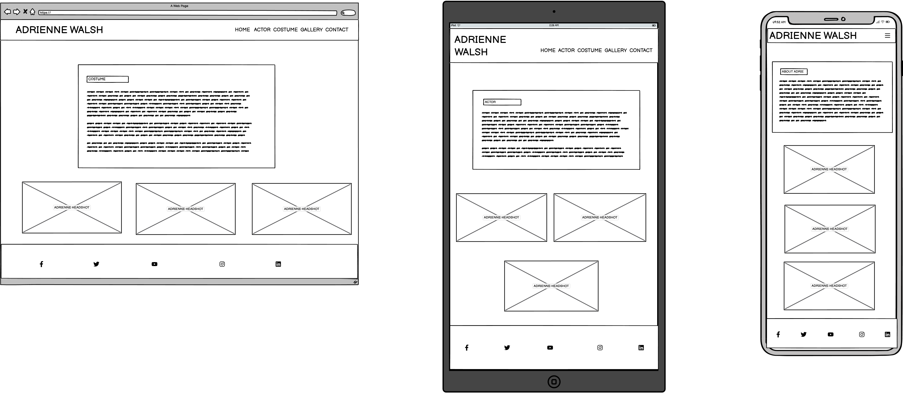

    -   #### Gallery Page Wireframes

        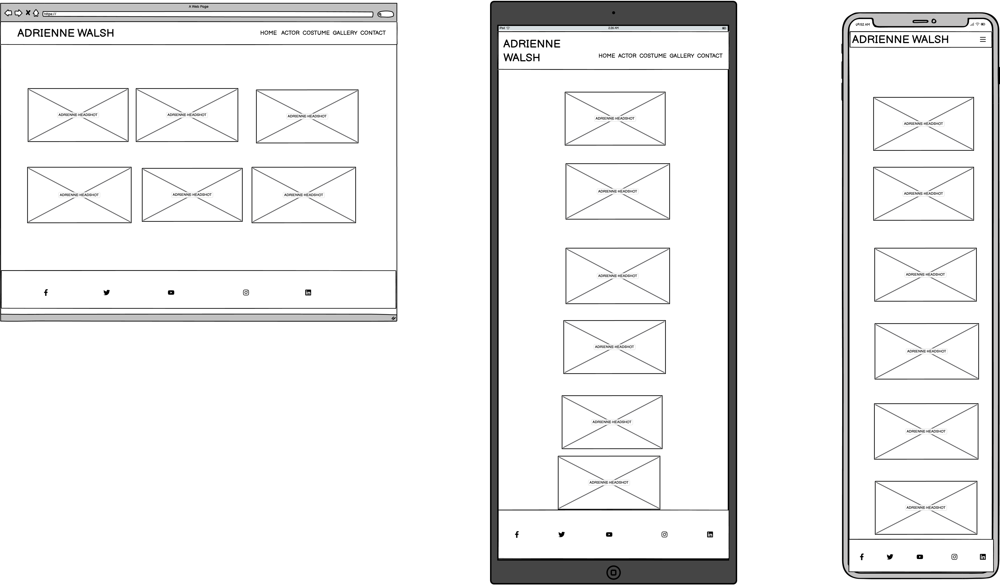    
        
    -   #### Contact Page Wireframes
        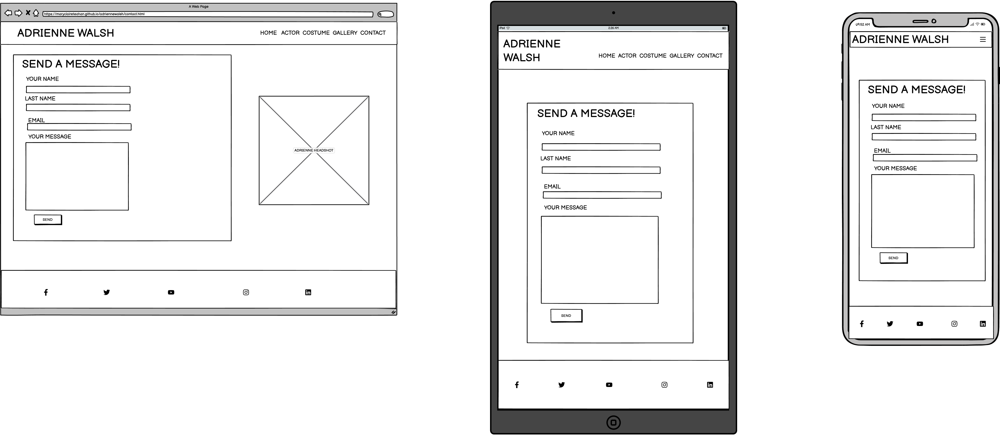

## Technologies Used

### Languages Used

-   [HTML5](https://en.wikipedia.org/wiki/HTML5)
-   [CSS3](https://en.wikipedia.org/wiki/Cascading_Style_Sheets)

### Frameworks, Libraries & Programs Used

-   [Google Fonts:](https://fonts.google.com/) was used to import the 'Lato' and 'Oswald' fonts into the style.css file which are used on all pages of the project.
-   [Font Awesome:](https://fontawesome.com/) was used to add icons for aesthetic and UX purposes.
-   [Git:](https://git-scm.com/) was used for version control by utilising the Gitpod terminal to commit to Git and Push to GitHub.
-   [GitHub:](https://github.com/) is used as the respository for the projects code after being pushed from Git.
-   [Balsamiq:](https://balsamiq.com/) was used to create the wireframes during the design process.
    

## Testing

### Validator Testing

- [HTML Validator](https://validator.w3.org/)

    - result for index.html
      
    - result for menu.html
      
    - result for contact.html
      

    - Full validation results are available on github here :

        - <a href="https://github.com/elainebroche-dev/ms1-thrive/blob/master/documentation/validation-results/html-validation-results-index.pdf" target="_blank">HTML Results - Home Page</a>

        - <a href="https://github.com/elainebroche-dev/ms1-thrive/blob/master/documentation/validation-results/html-validation-results-menu.pdf" target="_blank">HTML Results - Menu Page</a>

        - <a href="https://github.com/elainebroche-dev/ms1-thrive/blob/master/documentation/validation-results/html-validation-results-contact.pdf" target="_blank">HTML Results - Contact Page</a>

- [CSS Validator](https://jigsaw.w3.org/css-validator/)

    - result for styles.css 
      
      

      The warnings are due to 1) import of the Google fonts and 2) a webkit extension for Safari support of the flip-card effect used on the home page.

    - Full validation results are available on github here :

        - <a href="https://github.com/elainebroche-dev/ms1-thrive/blob/master/documentation/validation-results/css-validation-results.pdf" target="_blank">CSS Results - styles.css</a>

### Browser Compatibility

- Testing has been carried out on the following browsers :
    - Chrome Version 90.0.4430.212 (Official Build) (64-bit)
    - Firefox Version 88.0.1 (64-bit)
    - Edge Version 90.0.818.62 (Official build) (64-bit)
    - Safari on macOS Catalina (Safari  Version 14.0.3)
    
### Test Cases and Results

- The below table details the test cases that were used, the results and a cross-reference to the Feature ID that each test case exercised (click to open iamge):

  

### Known bugs

- My mentor reported an issue with the "Send Message" button when viewed on an iphone during a review meeting.  Neither of us has since been able to re-create this using the browser dev tools but I am adding an image of the issue here for completeness :

  

## Deployment

### How this site was deployed

- In the GitHub repository, navigate to the Settings tab, then choose Pages from the left hand menu 
- From the source section drop-down menu, select the Master Branch
- Once the master branch has been selected, the page will be automatically refreshed with a detailed ribbon display to indicate the successful deployment
- Any changes pushed to the master branch will take effect on the live project

  The live link can be found here - [THRIVE Juices and Smoothies](https://elainebroche-dev.github.io/ms1-thrive/index.html) 

### How to clone the repository

- Go to the https://github.com/elainebroche-dev/ms1-thrive repository on GitHub 
- Click the "Code" button to the right of the screen, click HTTPs and copy the link there
- Open a GitBash terminal and navigate to the directory where you want to locate the clone
- On the command line, type "git clone" then paste in the copied url and press the Enter key to begin the clone process
 
## Credits 

### Content 
- All content was provided by Adrienne Walsh and based on her actual experiences as actor and costume designer.

### Code
- Code on how to implement flex boxes was based on instructions from 
[A Complete Guide to Flexbox](https://css-tricks.com/snippets/css/a-guide-to-flexbox/)

### Media 
- The colours used were based on a citrus/pastel palette from this website : [Lily Bug Design - Colour Wall](https://www.lilybugdesign.co.nz/colour-wall) 
- The icons in the header, footer were taken from [Font Awesome](https://fontawesome.com/)
- The fonts used were imported from [Google Fonts](https://fonts.google.com/)

- All images were provided by Adrienne Walsh.

    
### Acknowledgments

- Thank you to my mentor Brian Macharia who gave me very good advice and feedback on how to plan and execute this project and who provided me with lots of pointers on resources to help select colours and images and well as resources to help with coding and testing.
